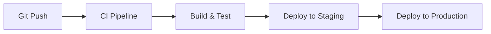

## Overview
Title: CI CD pipeline
Priority: High
Status: New
Created: 20250214 
Last Updated: 20250214

## Description
set ci-cd for the front and backends

## Requirements
- [ ] understnd git action
- [ ] understand staging

## Dependencies
- Other tasks that must be completed first
- graph

## Notes
- Progress updates
- Challenges encountered
- Decisions made

## Related
- Links to related issues : see notes below of the structure outline
- Reference documents
- Related debug sessions


##. CI/CD Pipeline Setup:
First, let's outline a basic CI/CD workflow for your Wagtail-NextJS application:



Here's how I recommend structuring this:

1. For Frontend (NextJS):
- Create a GitHub Actions workflow that:
  - Builds the application
  - Runs tests
  - Creates a production build
  - Deploys to your Linode server using SSH

2. For Backend (Wagtail):
- Similar workflow but with Django-specific steps:
  - Run Django tests
  - Check migrations
  - Deploy to server

Here's a suggested GitHub Actions workflow structure:

```yaml
name: Deploy Application

on:
  push:
    branches: [ main ]

jobs:
  deploy:
    runs-on: ubuntu-latest
    steps:
      - uses: actions/checkout@v2
      
      # Frontend build & test
      - name: Setup Node.js
        uses: actions/setup-node@v2
        with:
          node-version: '16'
      
      - name: Install frontend dependencies
        run: cd frontend && npm install
      
      - name: Build frontend
        run: cd frontend && npm run build
      
      # Backend test
      - name: Setup Python
        uses: actions/setup-python@v2
        with:
          python-version: '3.9'
      
      - name: Install backend dependencies
        run: cd backend && pip install -r requirements.txt
      
      - name: Run backend tests
        run: cd backend && python manage.py test
      
      # Deploy
      - name: Deploy to server
        uses: appleboy/ssh-action@master
        with:
          host: ${{ secrets.HOST }}
          username: ${{ secrets.USERNAME }}
          key: ${{ secrets.SSH_KEY }}
          script: |
            cd /path/to/your/app
            git pull
            # Frontend update
            cd frontend
            npm install
            npm run build
            pm2 restart next-app
            
            # Backend update
            cd ../backend
            source venv/bin/activate
            pip install -r requirements.txt
            python manage.py migrate
            systemctl restart uwsgi
```
